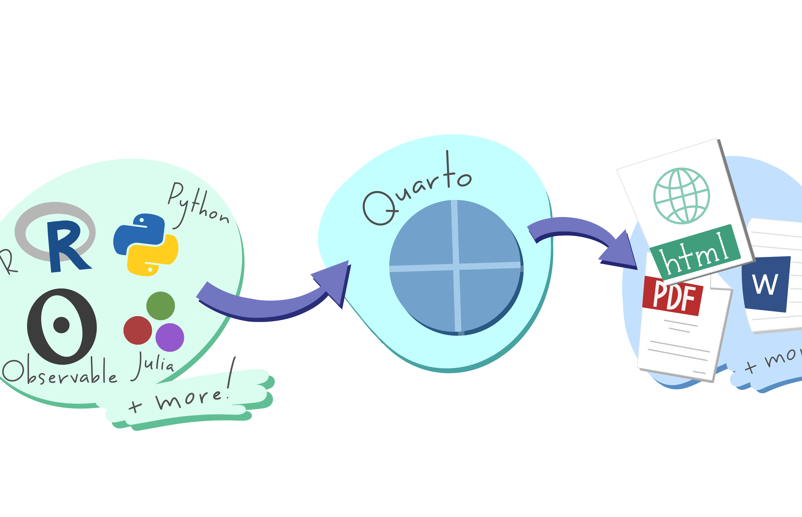

# Taller portafolio - FliSol 2023
Taller realizado por R-Ladies Mendoza para la FliSol Valle de Uco 2023

Grupo de Meetup de R-Ladies Mendoza: https://www.meetup.com/es/rladies-mendoza/

Título: 

**"Crea tu portafolio web con Quarto y RStudio"**

Evento: [https://eventol.flisol.org.ar/events/flisol-vera-2023/activity/412/](https://eventol.flisol.org.ar/events/flisol-vera-2023/activity/412/)

Diapositivas en línea: https://jgarriga.quarto.pub/taller-portafolio-flisol/

Tipo: Workshop / Taller

Nivel: Principiante

Disertantes: [Jess Garriga](https://www.linkedin.com/in/jess-garriga-b8bb95240/) y [Jan Strappa](https://www.linkedin.com/in/jan-strappa/?locale=en_US) 

**Descripción completa**

Un portafolio es una colección de proyectos y trabajos destacados que muestran a posibles clientes o empleadores tus habilidades y experiencia. Con este taller, adquirirás los conocimientos necesarios para crear y publicar un elegante portafolio web que podrás personalizar según tus necesidades. Aprenderás a utilizar Quarto para conseguir un sitio web de aspecto profesional de forma gratuita y sin tener que preocuparte demasiado por detalles técnicos. El taller está pensado para cualquier persona que quiera hacer un portafolio web atractivo para mostrar su experiencia laboral, habilidades, y/o promover sus servicios. Está dirigida a principiantes en adelante que quieran beneficiarse de herramientas de código abierto, gratuitas, libres, fáciles de usar y mantener, y sin requerir alojamiento de pago. Será útil estar familiarizade con lenguajes de marcado y con la interfaz de RStudio.

# [ENGLISH | ORIGINAL] quarto-portfolio-workshop
Workshop slides for my presentation at the TransTech Summit 2023.

Title:

**"Create your stunning web portfolio for job hunting and freelance services with Quarto (no coding required)"**

#1 Takeaway:

A portfolio is a collection of highlighted projects and previous works that show potential clients or employers your abilities. With this workshop, you will acquire the skills for creating and publishing an elegant portfolio that you can customize according to your needs. You will learn how to use Quarto to achieve a professional-looking website for free, and without having to worry too much about technical details.

**Who is this presentation for?**

Anyone who wants to make an attractive web portfolio to showcase their work experience, skills, and/or promote their services. This talk is aimed at tech and non-tech people who want to take advantage of this open source tool that is free, easy to use and maintain, and does not require coding nor paid hosting. No programming skills are needed; however, familiarity with markup languages, and with the VSCode user interface will be helpful.

